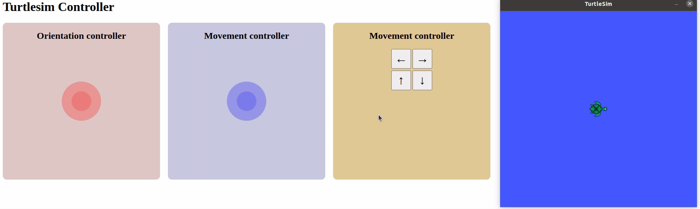

# Turtlesim Controller

A virtual controller for the ROS turtlesim_node using NippleJS and Rosbridge.



It allows you to control the ROS turtlesim_node from a simple webpapp using Rosbridge.
- Move the turtle with the right joystick or clicking the buttons. 
- Change its orientation using the left joystick.

You can execute the controller using tmuxinator or roslaunch, like a regular ROS node/pkg.

*This repo also contains some .py files inside the scripts folder, some extra code included to better know ROS functionalities using turtlesim_node.*


## Dependencies
- **[ROS Noetic](http://wiki.ros.org/noetic)**: provides the main code to develop robot applications.
- **[Rosbridge](http://wiki.ros.org/rosbridge_suite/Tutorials/RunningRosbridge)**: provides a JSON API to ROS functionality for non-ROS programs.
- **[NippleJS](https://yoannmoi.net/nipplejs/)**: provides a virtual joystick for touch capable interfaces.


## Setup

1. **Source ROS workspace**
```
source /opt/ros/noetic/setup.bash
```
2. **Create and set up the ROS project workspace**
```
mkdir turtlesim-controller-ws
cd turtlesim-controller-ws
mkdir src
catkin_make
```
This may have created new folders, *build* and *devel*, and a *CMakeLists.txt* file inside *src*.

3. **Clone the repo inside *src* folder**
```
cd src
git clone https://github.com/beallasai/turtlesim-controller.git
```


## Usage
There are two different ways to run the controller:
- **roslaunch**

**1.** Go back to the project folder (*turtlesim-controller-ws*)
```
cd ..
```
**2.** Source ROS workspace
```
source devel/setup.bash
```
**3.** Execute the *run.launch* file
```
roslaunch turtlesim-controller run.launch
```
  This will run everything in the same terminal

 Close it with `ctrl+c`

- **tmuxinator**

**1.** Go to the folder with the *.tmuxinator.yml* file
```
cd turtlesim-controller/tmux/run/
```

**2.** Execute the file
```
tmuxinator
```
This will open a tmux session with 3 panes:

  - Starts Rosbridge Server
  - Starts turtlesim_node
  - Opens the webapp in browser
  
  Move between panes using `ctrl+b` &uarr;, &darr;, &larr;, &rarr; 
  
  Close the session with `tquit`

### Now you can control the turtle using joysticks or buttons!!!


## Phone controller
You can also control the turtle with your phone:

**1.** Make sure your PC and phone are connected to the same WiFi

**2.** Change the line 4 in the *ros.js* file with your PC IP

**3.** Run the webpage executing the *phoneRun.launch* file:

- Go to the project folder (*turtlesim-controller-ws*)

- Source ROS workspace
```
source devel/setup.bash
```
- Execute the *phoneRun.launch* file
```
roslaunch turtlesim-controller phoneRun.launch
```
  This will run everything in the same terminal

 Close it with `ctrl+c`
 
**4.** Open the `IP:8000` in your phone browser

### Now you can move the turtle using your phone as a controller!!!